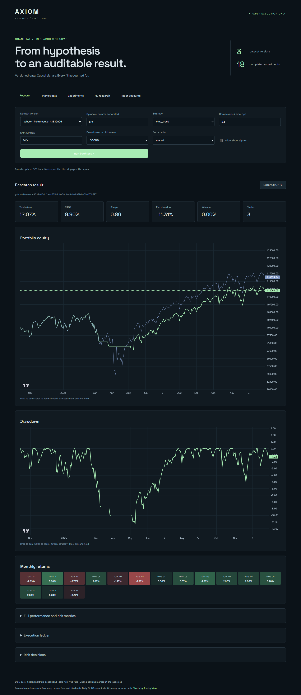
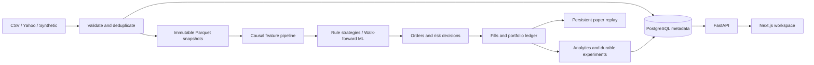
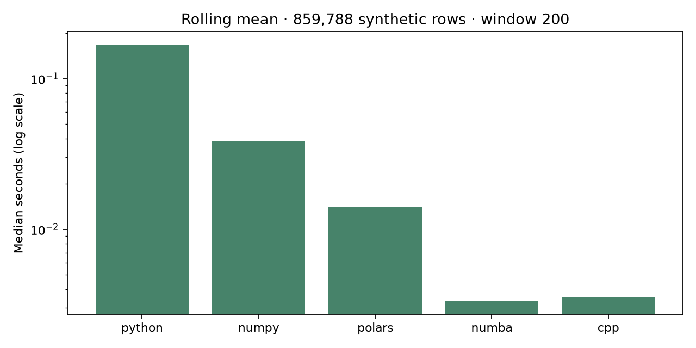

# Axiom — Quantitative Research & Execution Platform

A local daily-data research workspace with versioned Parquet data, PostgreSQL metadata, an event-driven portfolio engine, risk checks, walk-forward ML and paper execution. V0.2–V1.0 are implemented within the scope below. The original V0.1 CLI remains available; see [its guide](docs/v0.1-guide.md).



## Start this Windows checkout

```powershell
Set-Location C:\Users\nadee\Documents\quantitative_finance_analytics
# Start only if the isolated cluster is not already running:
.\.venv\Scripts\python.exe scripts/local_db.py start
.\.venv\Scripts\python.exe -m alembic upgrade head
# Optional: populate the reproducible 60-instrument synthetic demonstration:
.\.venv\Scripts\python.exe scripts/demo_platform.py
Set-Location apps/dashboard
npm ci
npm run build
Set-Location ../..
.\.venv\Scripts\python.exe scripts/dev.py
```

Open **http://127.0.0.1:8821**. The authenticated API is on port 8820. Credentials are generated in ignored `.env` by the local database helper; they never enter the browser bundle. Stop the app with `scripts/stop_dev.py`, and the isolated database with `scripts/local_db.py stop`. The database helper uses PostgreSQL 18 at `C:\Program Files\PostgreSQL\18\bin` and port 55442; set `POSTGRES_BIN` for another installation. Do not run the start helper twice against an already-running app.

## Install elsewhere

Requires Python 3.12+ (`pyproject.toml`), Node.js and PostgreSQL 18. Development uses Python 3.12 on Windows; the Docker images ship Python 3.14 and Node 26. CI tests Python 3.12 and 3.14 (with PostgreSQL), a Windows job and a Node 26 dashboard build; all of them passed on the `audit-fixes-2` branch (runs 36515900426 and 36515956881).

```sh
uv sync --frozen --extra dev --extra yahoo
# Copy .env.example to .env; configure your own database and random token.
uv run alembic upgrade head
uv run python scripts/demo_platform.py
cd apps/dashboard
npm ci
npm run build
cd ../..
uv run python scripts/dev.py
```

`uv.lock` and `apps/dashboard/package-lock.json` lock dependencies. Synthetic demonstrations require no market-data account. The 60 ETF names are a fixed research universe, not a point-in-time constituent database. New symbols have unverified exchange metadata rather than invented exchange assignments.

## What each phase delivers

| Phase | Implemented and verified scope |
|---|---|
| V0.2 | PostgreSQL/Alembic metadata, immutable versions and lineage, incremental overlap deduplication, conflict/gap rejection, 60-symbol universe, shared expanded feature pipeline |
| V0.3 | Next-open event replay, market/limit/stop/stop-limit orders, longs/shorts, partial fills, signed average-cost ledger, risk approve/modify/reject, portfolio analytics and benchmark comparison |
| V0.4 | FastAPI, server-side authenticated Next.js proxy, interactive research and price charts, experiment history, Docker Compose, portfolio showcase replacement (live on nadeemrazani.com) |
| V0.5 | Naive, logistic, random forest and XGBoost; expanding chronological train/validation/test folds; horizon purges; prediction evaluation separate from out-of-sample trading |
| V0.6 | Actual 342-instrument × 2,514-session synthetic workload; Python/NumPy/Polars/Numba/C++ kernel checks; profiling-driven optimization and recorded measurements |
| V1.0 | Optional Yahoo completed-daily-bar ingestion, scheduled paper ticks, persistent/idempotent paper accounts, stale/risk/failure alerts and an operational UI |

This is a single-user local research system. V1.0 does **not** mean exchange connectivity, real-money execution, tick-level simulation, or a publicly authenticated multiuser service.

## Architecture



Bars remain in partitioned Parquet. PostgreSQL stores instrument definitions, dataset versions and stream heads, experiment parameters/results/status and paper-account state. Ingestion takes a PostgreSQL advisory lock per provider/universe stream before merging. A failed SQL transaction can leave an unreferenced immutable snapshot, but never a partially published dataset pointer. Keep the database and snapshot directory together when backing up.

## Research workflow

1. Select a dataset version and comma-separated symbols in the dashboard.
2. Choose a rule, commission, EMA window, order type and risk settings.
3. Run the backtest. Inspect equity, drawdown, monthly returns, full statistics, fills and risk decisions; export the complete JSON.
4. Open previous runs from **Experiments**. Each run has a durable ID, config, provider, dataset hash, code commit when available, and a hash of the Python source tree.
5. Use **Market data** for candlesticks, EMA/Bollinger overlays and OHLCV/RSI inspection.
6. Use one instrument in **ML research**; this implementation deliberately does not mix cross-sectional rows into chronological splits.

API requests require `Authorization: Bearer <API_TOKEN>`. Routes include `/health`, `/datasets`, `/instruments`, `/market/{dataset_id}?symbol=SPY`, `/strategies`, `/experiments`, `/experiments/{id}`, `/paper`, and `/paper/{id}/advance`. The OpenAPI schema is served at `/openapi.json` behind the same token; FastAPI's interactive `/docs` and `/redoc` pages are disabled because they bypass app-level auth. Research POSTs are synchronous with durable status records and a bounded per-process admission gate. A lost browser connection does not imply the run failed: check history before retrying. After a process crash, stop workers and use `scripts/recover_runs.py` to mark old orphaned RUNNING records INTERRUPTED. There is no distributed task queue or automatic job resumption.

## Data and paper execution

```sh
uv run python scripts/ingest.py --provider yahoo --symbols SPY --start 2024-01-01 --end 2026-01-01
uv run python scripts/ingest.py --provider synthetic --symbols SPY,QQQ,TLT --start 2015-01-01 --end 2026-01-01
```

End dates are exclusive. Providers never silently substitute simulated data. Yahoo intervals containing a split are rejected; dividends are excluded. Existing overlapping prices cannot be silently revised. Different historical windows can fail on gaps or provider revisions, which must be investigated explicitly.

Create a paper account in the dashboard and advance its completed daily session. Repeating a tick returns the same fills; moving the clock backwards or changing previously processed bars is rejected. The implementation deterministically replays the prefix under a PostgreSQL row lock, so it favors auditability over long-running account throughput.

```sh
# One monitoring/replay tick, using the account's existing immutable dataset:
uv run python scripts/paper_tick.py ACCOUNT_ID
# Explicit opt-in: fetch newly completed Yahoo bars and paper-replay every 15 minutes.
# Requires a Yahoo-backed account and a contiguous existing ingestion stream.
uv run python scripts/paper_tick.py ACCOUNT_ID --live-data --loop --interval 900
```

The scheduler logs alerts and stores them on the paper account. `STALE_INPUT`, `RISK_REJECTION` and `TICK_FAILED` appear in the operational UI. It uses prior UTC dates only; this is daily polling, not intraday streaming. No real-money broker adapter exists. See [methodology](docs/methodology-v1.md) for accounting, risk and bias details.

## Measured scaling

The checked-in [benchmark results](docs/benchmarks/results.json) cover **859,788 synthetic bars** across **342 simulated instruments** and ten calendar years. The profiled replay improved from **56.66 s to 17.05 s** after removing redundant position serialization, with the same 11,100 fills and final equity. Final feature calculation took **1.81 s**; sampled peak process RSS was about **1,910 MiB**. These are development-machine observations, not service guarantees. The two runs had materially different ambient load (the unchanged Python kernel ran 1.68× faster in the second run), and the pre-optimization code and its profile are not committed, so the 3.3× figure is not an isolated measure of the optimization. Replay equivalence is regression-tested in `tests/test_platform.py::test_mark_serialization_optimization_preserves_replay`.



```sh
uv run python scripts/build_native.py
uv run python scripts/benchmark.py
```

The C++ build uses installed Visual Studio 2019 C++ tools on this Windows checkout or `c++` on Linux. Production features default to Polars; `FeatureConfig(rolling_backend="numba")` or `"native"` accelerates the Bollinger rolling mean. Native binaries are local build artifacts and are not committed. The benchmark checks numerical equality before timing. Numba cold compilation/cache loading is reported separately from five warm repetitions. Native kernels do not accelerate event accounting; the larger measured replay gain came from profiling the Python engine.

## Docker

Set random URL-safe `POSTGRES_PASSWORD` and `API_TOKEN` values in `.env` first.

```sh
docker compose up --build -d
docker compose exec api python scripts/demo_platform.py
# http://127.0.0.1:8821
docker compose down
```

PostgreSQL data, bars and reports use named volumes. Migrations complete before the API starts. Services run with a non-root application user and only loopback-facing app ports. Docker uses its own database and data volumes, independent of the native development cluster. Native C++ acceleration is optional and not built into the standard container. Public deployment needs a real user-authentication layer, TLS, quotas, backups and appropriate data licensing; the bundled proxy is intended for a trusted local user.

## Verification

```sh
uv run ruff check axiom tests scripts alembic
uv run ruff format --check axiom tests scripts alembic
uv run mypy axiom scripts
uv run python scripts/build_native.py
# Set AXIOM_TEST_DATABASE_URL to an isolated PostgreSQL test database:
uv run pytest -q
# This checkout's transactional integration harness uses its local database:
uv run python scripts/check_platform.py
uv run python scripts/check_browser.py
```

The browser harness needs Chromium installed through Playwright and both the Axiom app and portfolio at port 8790. Tests cover causal features, validation, snapshots, account reconciliation and reversal, gap/limit behavior, short leverage, partial fills, pending-order cancellation, horizon purges, PostgreSQL ingestion, authentication and paper idempotency. The GitHub Actions workflow (`.github/workflows/ci.yml`) is configured to run the PostgreSQL suite on Python 3.12 and 3.14, native kernel checks, static checks, a Windows test job without PostgreSQL (database tests skip), the Next.js typecheck and build on Node 26, and a Docker Compose build-and-smoke job.

## Portfolio

The portfolio route `/work/quantitative-finance-analytics/` on nadeemrazani.com (`personalportfolio` repository) replaces the old Golden Cross Tearsheet with Axiom. Its public explorer uses a copy of the [saved derived research results](docs/showcase.json), labels each study synthetic or observed-price, and works without a private API token. It does not pretend to run a backend from the public page. The full executable workspace runs separately on port 8821. The live site can lag this repository: the latest showcase copy and wording sit on the portfolio's `dev` branch until it is promoted to production.

## Limitations and next improvements

Daily US ETF price data only; no tick/quote feed, total-return adjustment, point-in-time universe, borrow inventory, financing, margin calls, taxes or real order routing. Shared portfolio replay currently requires aligned sessions. Protective exits become active on the bar after entry. ATR uses a simple rolling mean, while RSI uses Wilder smoothing. ML results on the supplied deterministic synthetic data validate software behavior and cannot establish predictive value. The recorded Yahoo studies (10 hand-picked ETFs in `docs/verification-evidence.json`; SPY in `docs/showcase.json`) and any study on the fixed 60-ETF universe are subject to selection and survivorship bias.

See [architecture](docs/architecture-v1.md), [methodology](docs/methodology-v1.md), [original brief](docs/project-brief.md), and [saved validation evidence](docs/validation-v1.md).
