# Axiom V0.1 architecture and implementation plan

## Objective and precise scope

Deliver one reproducible Data -> Features -> Strategy -> Backtest -> Results
vertical slice. This is the first implementation milestone, not the complete
execution platform. No portfolio page is modified during this milestone.

V0.1 covers ten USD-listed ETFs, daily bars, CSV and optional Yahoo providers,
validation and quality reports, content-addressed Parquet snapshots, configurable
RSI/EMA/Bollinger features, long/flat strategies, next-open execution with costs,
cash/position reconciliation, common-window buy-and-hold, JSON/CSV reports and tests.
Later stages introduce PostgreSQL, full event/order/risk semantics, API/dashboard,
ML and profiled optimization. No real-money execution is implemented.

## Architecture

```mermaid
flowchart LR
  P[CSV / Yahoo / synthetic provider] --> R[Immutable RAW capture]
  R --> C[Canonical CLEAN schema]
  C --> V[Calendar-aware validation]
  V --> S[VALIDATED Parquet snapshot]
  S --> F[Shared feature pipeline]
  F --> G[Strategy target: 0 or 1]
  G --> B[Next-open backtest and ledger]
  B --> A[Analytics and benchmark]
  A --> E[Versioned research report]
```

## Initial universe

SPY, QQQ, IWM, DIA, EFA, EEM, TLT, IEF, GLD, SLV. This is a fixed research
universe spanning equity, Treasury and commodity exposures, not an investment
recommendation or a historical point-in-time investable universe. All use the
XNYS session calendar as an initial US ETF session-calendar proxy. Exchange
metadata is separate from that calendar and must not be inferred from it.
Survivorship and selection bias still apply. Do not claim ETF selection removes bias.

## Historical source decision

Recommend locally frozen CSV snapshots obtained from Yahoo Finance through an
optional yfinance adapter for initial personal research. It is accessible without
embedding broker credentials and supplies the initial instruments. It is not an
exchange-grade feed or an official Yahoo SDK. Provider revisions, rate limits,
corporate actions and terms constrain its use. Never commit downloaded market
history or assume redistribution rights for the eventual public dashboard.

The adapter explicitly requests raw OHLC plus corporate actions. V0.1 rejects
nontrivial split events within the requested interval; it does not silently
trade through a split. Dividends are not credited, so results are price returns,
not total returns. Benchmark uses identical assumptions. CSV imports must declare
price basis. Adjusted data is not mixed with raw data. Later support must account
for corporate actions and point-in-time adjustment policy explicitly.

An offline synthetic provider generates ten clearly labelled instruments for
tests/demo. Its metrics are plumbing evidence only. Historical download failure
never silently falls back to synthetic data.

References:
- https://ranaroussi.github.io/yfinance/reference/api/yfinance.download.html
- https://ranaroussi.github.io/yfinance/
- https://docs.pola.rs/api/python/stable/reference/expressions/index.html

## Repository and interfaces

- `axiom/common/models.py`: Instrument, FeatureConfig, BacktestConfig.
- `axiom/data/providers.py`: Provider protocol / CSVProvider / SyntheticProvider / YahooProvider.
- `axiom/data/validation.py`: canonicalize and validate -> frame plus QualityReport.
- `axiom/data/storage.py`: SnapshotStore captures raw and publishes immutable validated versions.
- `axiom/features/pipeline.py`: FeaturePipeline transforms sorted validated bars causally.
- `axiom/strategies/simple.py`: Strategy protocol -> target exposure; never changes cash.
- `axiom/backtest/engine.py`: replay targets -> daily equity and fill ledger.
- `axiom/analytics/metrics.py`: pure calculations from equity/ledger.
- `axiom/research.py`: orchestrates snapshots, strategy/baseline and evidence.
- `axiom/cli.py`: reproducible ingest/research/demo commands.
- `configs/`: universe and settings; `tests/`: unit/integration/regression.
- `docs/`: decisions, execution semantics and operating guide.

## Canonical schema

`instrument: String`, `timestamp: Datetime(us, UTC)`, `timeframe: String (=1d)`,
`open/high/low/close/volume: Float64`, `source: String`,
`ingested_at: Datetime(us, UTC)`, `price_basis: String (=raw_price or synthetic)`.
Daily timestamp is the session DATE labelled at 00:00 UTC, not a market close
instant. It is never compared as if it were the timestamp when the price became
available. Signals use the complete bar and fill only at the next session open.
Metadata includes symbol, asset class, exchange, currency, sector, industry,
timezone, active_from and active_to. Unknown values remain explicit nulls.

Key = instrument + timeframe + timestamp. Multiple sources for the same key are
not silently merged. Identical duplicate observations are collapsed and reported;
conflicting duplicates are rejected. Ingestion time is excluded from content
hashing so identical observations produce the same snapshot ID.

## Storage

RAW stores each input capture plus metadata. CLEAN is canonical in memory (not
another unnecessary physical copy); VALIDATED snapshots use
`validated/<hash>/asset_class=etf/timeframe=1d/symbol=<symbol>/year=<year>/bars.parquet`.
FEATURES belong to each research run because indicator settings are versioned.
No monthly partitions for daily V0.1 data: they create tiny files. Immutable version
folders publish through staging rename; a manifest marks completeness. Single
writer only in V0.1; multiwriter locking/metadata transactions come in V0.2.
Content-based snapshots make repeated imports observation-idempotent. There is
no automatic incremental merging of changing snapshots until V0.2.

## Testing strategy and acceptance

Test invalid OHLC/volume/timestamps, weekends/holidays/missing sessions, exact vs
conflicting duplicates, stale reports, snapshot idempotence, feature causality
(prefix equality), RSI edge cases, Bollinger values, next-open fills, cost/cash
constraints, equity reconciliation and common benchmark windows. Offline
integration covers all ten symbols and repeatability. Lint and type checking run
alongside pytest. Network downloads are manual integration checks, never CI dependencies.

Acceptance: offline ten-symbol pipeline produces validated immutable Parquet,
causal features, reconciled strategy/baseline ledgers and clearly labelled metrics;
all automated checks pass; commands and assumptions documented; initial Git commit.

## Mistakes to avoid now

Do not use same-close fills; optimize on final test data; claim profit from a
classifier score; mix adjusted closes with raw opens; hide warm-up differences;
fill missing prices forward without recording it; mix currencies; conflate ten
independent accounts with one portfolio; fabricate 342-instrument speedups; or
build the UI before the accounting is verifiable. Float64 money in this research
slice uses explicit reconciliation tolerance and fractional units; broker-grade
lot/tick/decimal semantics belong to the execution stage.
